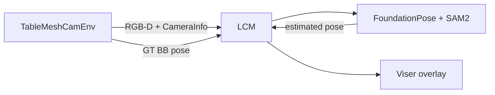

# FoundationPose in MuJoCo (sim RGB-D)

Track a textured mesh object in a **robot-free** MuJoCo scene: the env
publishes RGB-D over LCM, FoundationPose estimates the object’s **6D pose**,
and Viser overlays the estimate against ground truth.



---

## 0. Ideas (what is being estimated?)

### 6D object pose

A rigid object in 3D has **six degrees of freedom**:

- **3 translation** — where the origin of the object frame is in the world
  (or camera) frame: $(t_x, t_y, t_z)$.  
- **3 rotation** — how the object’s axes are oriented (a rotation matrix
  $R \in \mathrm{SO}(3)$, or equivalently roll/pitch/yaw, quaternion, …).

Together they form a homogeneous transform

$$
T_{\mathrm{obj}\to\mathrm{world}}
=
\begin{bmatrix}
R & t \\
0 & 1
\end{bmatrix}
\in \mathrm{SE}(3).
$$

**FoundationPose** estimates this pose of a known CAD mesh from a single RGB-D
frame (registration), then **tracks** it over time as the object moves.

Why do we care? Grasping, packing, and AR overlays all need “where is the
object, and how is it rotated?” relative to the robot or the camera.

### RGB-D and the camera model (short)

Each camera frame gives:

- **RGB** — color image, shape $(H, W, 3)$.  
- **Depth** — per-pixel distance along the camera’s optical axis (in sim,
  meters; on many RealSense streams, millimeters × `depth_factor`).

With **intrinsics** $K$ (focal length, principal point) you can back-project a
pixel $(u,v)$ with depth $Z$ into a 3D point in the **camera frame**:

$$
X_c = Z\, K^{-1}
\begin{bmatrix} u \\ v \\ 1 \end{bmatrix}.
$$

**Extrinsics** $T_{\mathrm{world}\to\mathrm{cam}}$ (see
[tutorial 14](14_diff_camera_calibration.md)) place that point in the world /
robot-base frame. FoundationPose uses $K$ and the depth image heavily; in this
sim both come from MuJoCo via LCM `CameraInfo` + RGB-D.

### What SAM2 is doing

FoundationPose needs a **mask** of the object (which pixels belong to the
mustard bottle). **SAM2** (Segment Anything 2) is an interactive / video
segmentation model: you click the object once; it produces a mask, and can
follow the object in later frames.

Without a mask, the pose estimator does not know which depth points are the
object vs the table.

### FoundationPose in one paragraph

Given (1) a CAD mesh of the object, (2) RGB-D, (3) a mask, and (4) camera $K$:

1. **Register (first frame):** sample many pose hypotheses, render the mesh
   under each hypothesis (nvdiffrast), score how well renders match the RGB-D
   observation, and refine the best pose with a learned refiner network.  
2. **Track (later frames):** warm-start from the previous pose and refine
   again — cheaper than full global registration every frame.

The networks (refiner + score model) are the downloaded weights under
`third_party/FoundationPose/weights/`. The native `mycpp` extension speeds up
pose clustering during registration.

### What you compare in Viser

- **Opaque mesh** — FoundationPose’s estimate (published on `fp_obj_pose`).  
- **Translucent “ghost”** — MuJoCo ground-truth object pose (published by the
  env).  

If tracking works, they should overlap. A small lag while the object moves is
normal.

### Pose encoding on LCM

Both GT and estimate travel as a 12-vector (NamedVec): translation + row-major
rotation of an **oriented bounding box** frame → world:

$$
\mathbf{v}
=
[t_x, t_y, t_z, R_{00},\ldots,R_{22}].
$$

CAD mesh rendering uses an extra fixed offset from the bounding-box frame to
the mesh frame:

$$
T_{\mathrm{CAD}\to W}
=
T_{\mathrm{BB}\to W}\,
T_{\mathrm{CAD}\to\mathrm{BB}}.
$$

You do not need to manipulate these by hand in the tutorial; the env and
visualizer already agree on the convention.

---

## 1. Prerequisites

Use the `rophi` conda env (or equivalent) with MuJoCo, LCM, torch, and CUDA.

### LCM multicast (Linux)

```bash
sudo ifconfig lo multicast
sudo route add -net 224.0.0.0 netmask 240.0.0.0 dev lo
```

Without this, processes on one machine often cannot see each other’s LCM
multicast traffic (`Couldn't create LCM` or silent “waiting for camera”).

### nvdiffrast (CUDA)

FoundationPose renders pose hypotheses with **nvdiffrast**. `nvcc` and PyTorch
must report the **same** CUDA major.minor (the build checks this):

```bash
nvcc --version                    # e.g. release 12.8
python -c "import torch; print(torch.version.cuda)"  # must match, e.g. 12.8
```

If they differ (common error: `detected CUDA version 12.8` vs `PyTorch 13.0`),
either reinstall PyTorch for your toolkit **or** point `CUDA_HOME` at a toolkit
that matches PyTorch.

**Option A — keep system CUDA 12.8, force-reinstall PyTorch cu128**  
(`pip install ... cu128` alone is a no-op if the same version is already
installed as cu130):

```bash
pip uninstall -y torch torchvision
pip install torch torchvision --index-url https://download.pytorch.org/whl/cu128
python -c "import torch; print(torch.__version__, torch.version.cuda)"  # expect ...+cu128 12.8
export CUDA_HOME=/usr/local/cuda-12.8
export PATH="$CUDA_HOME/bin:$PATH"
```

**Option B — keep PyTorch cu130, use a CUDA 13** `nvcc`  
Install the CUDA 13 toolkit (or `nvidia-cuda-nvcc` wheel) and set `CUDA_HOME`
so `nvcc --version` reports 13.x.

Then build nvdiffrast:

```bash
pip install setuptools wheel ninja
pip install git+https://github.com/NVlabs/nvdiffrast.git --no-build-isolation
```

### Third-party stacks (not vendored)

FoundationPose and SAM2 are imported as `third_party.FoundationPose` / `sam2`.

**SAM2 (required for** `build_sam2_camera_predictor`**)** — use the real-time
fork, not stock Meta SAM2.

Use `--no-build-isolation` so the CUDA extension builds against **your** env’s
PyTorch (isolated builds often pull a mismatched CUDA torch and fail with
`12.8` vs `13.0`):

```bash
# From the repo root; CUDA_HOME must match torch.version.cuda
export CUDA_HOME=/usr/local/cuda-12.8
export PATH="$CUDA_HOME/bin:$PATH"
python -c "import torch; print(torch.__version__, torch.version.cuda)"  # expect ...+cu128 12.8

mkdir -p third_party && cd third_party
git clone https://github.com/Gy920/segment-anything-2-real-time.git sam2
cd sam2
pip install -e . --no-build-isolation
python -c "from sam2.build_sam import build_sam2_camera_predictor; print('sam2 OK')"
cd ../..
```

Checkpoints for the tutorial config (`sam2.1_hiera_tiny`) are pulled from
HuggingFace on first run (`facebook/sam2.1-hiera-tiny`). You can also download
them into `third_party/sam2/checkpoints/` via that repo’s
`checkpoints/download_ckpts.sh`.

**FoundationPose + pytorch3d:**

```bash
mkdir -p third_party && cd third_party
git clone https://github.com/NVlabs/FoundationPose.git
cd ../..

# pytorch3d — FoundationPose only needs `pytorch3d.transforms` (no CUDA ops).
# Prefer a CPU-only build (minutes, not hours). If a prior build hung:
#   pkill -f 'nvcc|pip install.*pytorch3d'
export CUDA_HOME=/usr/local/cuda-12.8
export PATH="$CUDA_HOME/bin:$PATH"
FORCE_CUDA=0 MAX_JOBS=8 pip install --no-build-isolation "git+https://github.com/facebookresearch/pytorch3d.git"
python -c "from pytorch3d.transforms import so3_exp_map; print('pytorch3d OK')"

# Remaining FoundationPose Python deps (includes `transformations`, open3d, trimesh, …)
pip install -r third_party/FoundationPose/requirements.txt

# Build the native `mycpp` extension (required — without it you get
# `AttributeError: module 'mycpp' has no attribute 'cluster_poses'`).
# Prefer system g++ (build_all_conda.sh uses /usr/bin/g++ when present) so the
# .so matches the libstdc++ that Torch/OpenCV already load; conda GCC 14+ can
# fail with CXXABI_1.3.15.
conda install -y -c conda-forge eigen boost-cpp pybind11 ninja
cd third_party/FoundationPose && bash build_all_conda.sh && cd ../..
python -c "from third_party.FoundationPose.Utils import mycpp; assert hasattr(mycpp,'cluster_poses'); print('mycpp OK', mycpp.__file__)"

# Network weights (required): download from
#   https://drive.google.com/drive/folders/1DFezOAD0oD1BblsXVxqDsl8fj0qzB82i?usp=sharing
# and place under third_party/FoundationPose/weights/
# Need folders:
#   weights/2023-10-28-18-33-37/   # pose refiner
#   weights/2024-01-11-20-02-45/   # score model  (config.yml + ckpts)
mkdir -p third_party/FoundationPose/weights
```

If you later need pytorch3d CUDA ops, rebuild for **your GPU arch only**, e.g.
`TORCH_CUDA_ARCH_LIST="8.9" FORCE_CUDA=1 MAX_JOBS=8 pip install --no-build-isolation --force-reinstall "git+https://github.com/facebookresearch/pytorch3d.git"`.

Also required: `transformers` / HuggingFace access for the SAM2 checkpoint
(downloaded on first run).

---

## 2. Run (three terminals)

```bash
# Terminal 1 — MuJoCo table + mustard bottle + RGB-D
python run_env.py --config configs/perception_tutorial/env/table_mesh_cam.yaml

# Terminal 2 — FoundationPose + SAM2 tracking
python run_perception.py --config configs/perception_tutorial/foundation_pose_sim.yaml

# Terminal 3 — Viser overlay (estimate + GT ghost)
python run_visualizer.py --config configs/perception_tutorial/visualizer/obj_pose.yaml
```

Open Viser at [http://localhost:8080](http://localhost:8080).

### What each process is responsible for

| Process | Role |
|---------|------|
| **Env** | Steps MuJoCo, renders RGB-D from `upper_camera`, publishes images + $K$/extrinsics + GT object pose |
| **Perception** | Consumes RGB-D, runs SAM2 + FoundationPose, publishes the estimated pose |
| **Visualizer** | Draws estimated mesh vs GT ghost in the browser |

This split (via LCM) mirrors how a real robot stack separates simulation /
drivers, perception, and UI.

### Interaction

| Key / action | Where | Effect |
| ------------ | ----- | ------ |
| Click on mustard | perception OpenCV window | First-frame SAM2 mask → FoundationPose register |
| `s` | env | Toggle slow yaw spin (makes tracking obvious) |
| `r` | env | Reset object pose |
| `p` / `q` | env / perception / vis | Pause / quit |

### Suggested first run

1. Start env → confirm mustard is on the table and the MuJoCo viewer shows the
   camera marker.  
2. Start perception → wait until camera intrinsics/extrinsics initialize, then
   **click the bottle** in the OpenCV window (window must be focused).  
3. Start visualizer → opaque mesh = FoundationPose estimate; translucent ghost
   = sim GT.  
4. Press `s` in the env to spin the object and watch the estimate follow.

---

## 3. LCM channels

| Channel | Type | Producer → consumer |
| ------- | ---- | ------------------- |
| `upper_camera` | `rgbd_t` | Env → FoundationPose |
| `upper_camera_info` | `camera_info_t` | Env → FoundationPose ($K$, world→cam, `depth_factor=1`) |
| `fp_obj_pose` | NamedVec 12 | FoundationPose → Viser |
| `sim_obj_pose_bb2world` | NamedVec 12 | Env (GT) → Viser ghost |

---

## 4. What you should observe

- After the click, the OpenCV debug view draws a posed box / axes on the
  bottle.  
- In Viser, the opaque mesh should sit on the translucent GT ghost (small lag
  is normal while tracking).  
- With spin (`s`), both meshes rotate together; if the estimate drifts, SAM2
  auto-reset may re-register.

### Rates

| Process | Typical rate | Work |
| ------- | ------------ | ---- |
| Env | 500 Hz physics, ~15 Hz RGB-D | MuJoCo step + camera render |
| Perception | camera-limited | SAM2 mask + FoundationPose track |
| Viser | 30 Hz | Mesh / axes update |

Perception is almost always slower than physics: deep models run once per
camera frame, not once per sim step.

---

## 5. How the pieces fit (mental model)

```text
MuJoCo scene  --render-->  RGB + Depth + K + T_world2cam
                                |
                         click → SAM2 mask
                                |
                    FoundationPose register / track
                                |
                         T_object→world estimate
                                |
                    Viser: estimate mesh ↔ GT ghost
```

Related next step: once a **robot** is in the loop, you also need accurate
**camera extrinsics w.r.t. the robot base** so object poses in the camera can
be expressed for grasping — that is [tutorial 14](14_diff_camera_calibration.md).

---

## 6. Common failures

| Symptom | Likely cause |
| ------- | ------------ |
| `Couldn't create LCM` | Multicast route missing (see above) |
| `No module named 'third_party.FoundationPose'` / `nvdiffrast` / `sam2` / `pytorch3d` / `transformations` | Third-party / FP requirements incomplete |
| `weights/.../config.yml` not found | Download FoundationPose weights into `third_party/FoundationPose/weights/` |
| `AttributeError: module 'mycpp' has no attribute 'cluster_poses'` | Rebuild `mycpp` with system g++ (`build_all_conda.sh`) |
| Perception never leaves “waiting for camera” | Env not running, or channel ≠ `upper_camera` |
| Click does nothing | Focus the OpenCV window; click the bottle; ensure depth is valid |
| Viser mesh at origin forever | No messages on `fp_obj_pose` yet (click / register first) |
| Texture missing / black object | Missing `material_0.png` next to `textured_mesh.obj` |
| nvdiffrast / SAM2 CUDA version errors | `nvcc` must match `torch.version.cuda` |

---

## 7. Code map

| Piece | Path |
| ----- | ---- |
| Scene XML | `assets/scene/perception_tutorial/table_mesh_cam.xml` |
| Env | `env/perception_tutorial/TableMeshCamEnv.py` |
| Cam LCM pub | `communication/lcm/publisher/pub_manager/env/CamOnlyPubManager.py` |
| Perception config | `configs/perception_tutorial/foundation_pose_sim.yaml` |
| Perception entry | `run_perception.py` |
| Viser manager | `visualizer/vis_manager/perception_tutorial/ObjPoseVisManager.py` |
| Camera helpers | `utils/mujoco/camera.py` |
