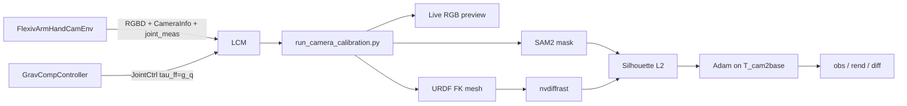

# Differentiable base–camera calibration (sim)

Estimate where a fixed camera sits relative to the robot base by matching
**silhouettes**: a SAM2 mask of the real (sim) RGB image vs a differentiable
rendering of the URDF at the measured joint angles.

You pose the Flexiv arm under gravity compensation, capture a few views, click
to segment the robot, then Adam refines the camera extrinsics.



---

## 0. Ideas (why this exists)

### What problem are we solving?

A depth camera (or RGB camera) sees the world in **pixel** coordinates. The
robot controller plans in the **robot base** frame (meters, attached to the
arm mount). To put a 3D point from the camera into the same frame as the arm
— for grasping, collision checking, or overlaying a mesh on the image — you
need a rigid transform between those two frames.

That transform is the **extrinsic calibration** of the camera w.r.t. the
robot. In this tutorial the camera is bolted to the world (fixed in the sim
cell), so we estimate a single constant pose: **camera in the arm-base
frame**.

Classical methods use a checkerboard or AprilTag and solve a hand–eye
problem (`AX = XB`). Here we use a **differentiable rendering** idea popularized
by EasyHeC: if you know the robot’s joint angles and its mesh, you can
*predict* which pixels the robot should occupy. Aligning that prediction to a
segmentation of the actual image recovers the camera pose.

### Intrinsics vs extrinsics (camera model)

A pinhole camera has two kinds of parameters.

**Intrinsics** $K$ (3×3) describe the *lens / sensor* — how a 3D point in the
**camera frame** maps to a pixel $(u,v)$:

$$
K = \begin{bmatrix} f_x & 0 & c_x \\ 0 & f_y & c_y \\ 0 & 0 & 1 \end{bmatrix},
\qquad
\begin{bmatrix} u \\ v \\ 1 \end{bmatrix}
\sim
K
\begin{bmatrix} X_c \\ Y_c \\ Z_c \end{bmatrix}.
$$

- $f_x, f_y$: focal length in pixels  
- $c_x, c_y$: principal point (image center, ideally)

In this sim tutorial, $K$ is known exactly from MuJoCo’s field of view and
image size (`get_camera_intrinsics`). We **do not** optimize $K$.

**Extrinsics** describe *where the camera is* relative to another frame. Two
equivalent 4×4 homogeneous matrices are used in the code:

| Name | Symbol | Meaning |
|------|--------|---------|
| **cam-in-base** (EasyHeC / eyeball) | $T_{\mathrm{cam}\leftarrow\mathrm{base}}$ written `T_cam2base` | Camera pose **expressed in the robot base**. Columns of $R$ are the camera’s right / down / forward axes in base; translation is the **camera eye** in base. |
| **world-to-cam** (OpenCV projection) | $T_{\mathrm{world}\to\mathrm{cam}}$ written `T_world2cam` | Maps a point from base/world into the camera frame: $X_c = R X_b + t$. |

They are inverses of each other:

$$
T_{\mathrm{world}\to\mathrm{cam}}
=
T_{\mathrm{cam}\leftarrow\mathrm{base}}^{-1}.
$$

OpenCV’s camera frame is: **$+X$ right, $+Y$ down, $+Z$ forward** (into the
scene). That matches EasyHeC and
`Manipulator-Software/scripts/calibration/eyeball_camera_pose.py`.

When we **render**, we need $T_{\mathrm{world}\to\mathrm{cam}}$ so mesh
vertices in the base frame become camera coordinates, then pixels via $K$.
When we **report / save** a calibration for EasyHeC-style tools, we report
`T_cam2base` (cam-in-base).

### Why joint angles matter

The silhouette of the arm changes with configuration $q$. The calibration
script:

1. Reads arm (+ hand) `joint_meas` over LCM.  
2. Runs URDF forward kinematics to place the visual meshes in the base frame.  
3. Renders those meshes with the **candidate** camera pose.  
4. Compares the render to a SAM2 mask of the RGB image taken at the **same**
   $q$.

If $q$ were wrong (e.g. stuck at the default pose while you moved the arm),
the rendered robot would not match the image no matter how you tweak the
camera — optimization cannot converge. The live RGB overlay prints
`arm_deg=[…]` so you can verify joints are updating before capturing.

### Differentiable silhouette matching

Let $M$ be a binary mask of the robot in the image (from SAM2) and $\hat M(T)$
the soft silhouette rendered under camera pose $T$. We minimize

$$
\mathcal{L}(T)
=
\frac{1}{N}
\sum_{i=1}^{N}
\sum_{u,v}
\bigl(M_i(u,v) - \hat M_i(u,v; T)\bigr)^2
$$

over $N$ captured views. Because nvdiffrast’s rasterizer is differentiable
w.r.t. vertex positions (hence w.r.t. $T$), Adam can walk $T$ downhill.

We parameterize $T_{\mathrm{cam}\leftarrow\mathrm{base}}$ by a 3D axis-angle
$\omega$ and translation $t$ (6 DoF), initialize near the MuJoCo ground-truth
pose plus a little noise, and refine. Intrinsics stay fixed.

**Why several poses?** One silhouette underconstrains the camera (depth /
foreshortening ambiguities). Diverse arm configurations give different
projected outlines and pin down the 6-DoF pose.

---

## 1. Prerequisites

Use the `rophi` conda env with MuJoCo, LCM, torch, CUDA, **nvdiffrast**, and
**SAM2** (same stack as [tutorial 13](13_foundation_pose_sim.md)).

### LCM multicast (Linux)

```bash
sudo ifconfig lo multicast
sudo route add -net 224.0.0.0 netmask 240.0.0.0 dev lo
```

### nvdiffrast + SAM2

Follow the install steps in tutorial 13 (`nvdiffrast` with matching CUDA, and
`third_party/sam2` from the real-time fork). pytorch3d is used only for
`so3_exp_map` / `so3_log_map` (CPU build is enough).

---

## 2. Run (three terminals)

```bash
# Terminal 1 — Flexiv arm + hand + calib_camera RGB-D
python run_env.py --config configs/calibration_tutorial/env/flexiv_arm_hand_cam.yaml

# Terminal 2 — gravity compensation (free float / drag in MuJoCo)
python run_controller.py --config configs/calibration_tutorial/controllers/grav_comp.yaml

# Terminal 3 — live RGB capture → SAM2 → optimize extrinsics
python run_camera_calibration.py --config configs/calibration_tutorial/calib_diff_render.yaml
```

Keep `platform.gravity_comp: false` in the env YAML so gravity is not cancelled
twice ([03](03_grav_comp.md)). Terminal 2 owns $g(q)$; Terminal 1 must not.

### Why gravity compensation?

You need **several different** arm shapes in the camera view. Gravity
compensation ([03](03_grav_comp.md)) lets you drag the arm in MuJoCo without it
collapsing, while the plant does not also add $g(q)$ (that would double-comp
and shoot the arm upward).

### Interaction

| Step | What to do |
|------|------------|
| Pose | In the MuJoCo viewer, drag the arm. Watch **Calib RGB** until the robot is clearly in view. Confirm `arm_deg=[…]` changes as you move |
| Capture | Press **SPACE** in the RGB window (`num_captures`). ESC finishes early (need ≥2). **Ctrl+C in the terminal** also exits |
| Segment | For each capture, **left-click** the arm (not the background), then **ENTER** (R resets clicks) |
| Optimize | Watch the mosaic `obs \| rend \| \|diff\|` — start slightly mismatched, then align; loss should fall |
| Done | Press any key in the mosaic window; terminal prints `T_cam2base`, `T_world2cam`, and error vs MuJoCo GT |

---

## 3. LCM channels

| Channel | Direction | Content |
|---------|-----------|---------|
| `calib_camera` | env → calib | RGB-D images |
| `calib_camera_info` | env → calib | Intrinsics $K$ + GT OpenCV `T_world2cam` (for scoring only) |
| `sw_flexiv_arm_joint_meas` | env → ctrl / calib | 7-DoF arm $q,\dot q,\tau$ |
| `sw_robotis_5F_hand_joint_meas` | env → ctrl / calib | 20-DoF hand $q,\dot q,\tau$ |
| `sw_flexiv_arm_hand_joint_ctrl` | **grav-comp → env** | $\tau_{\mathrm{ff}}\approx g(q)$, $K_p=K_d=0$ |

The calibration script **subscribes** to camera + joints and does **not**
publish joint commands (so it does not fight gravity compensation).

In this sim, GT extrinsics are available from MuJoCo so we can print
millimeter / degree error after optimization. On a real robot you would not
have that GT — the same silhouette pipeline still produces `T_cam2base`.

---

## 4. What you should observe

1. With grav-comp running, the arm feels weightless; you can drag it to diverse
   configurations.  
2. **Calib RGB** shows the live camera feed; `arm_deg` and `updates=` should
   tick as joints stream in.  
3. After each SAM click, a masked gray preview of the robot appears.  
4. Optimization starts from **GT cam-in-base ⊕ small SE(3) noise** (~5° / 3 cm)
   — roughly correct, then refined (EasyHeC-style: `lr=3e-3`, up to 2000
   iters, early-stop 200).  
5. The `|diff|` panel darkens as loss drops; final trans/rot error vs GT is
   printed.

---

## 5. Method (pipeline detail)

### Observed silhouette

$$
I_{\mathrm{obs}}
=
\mathrm{grayscale}(\mathrm{RGB})
\odot
M_{\mathrm{SAM2}},
$$

then treated as a binary mask $M = [I_{\mathrm{obs}} > 0]$ for the loss.
SAM2 only needs a click on the robot; it does not need to know the camera pose.

### Rendered silhouette

1. **FK:** [`RobotMeshFK`](../utils/calibration/robot_mesh_fk.py) loads the
   Flexiv URDF visuals and articulates them at the measured $q$ (yourdfpy).
   Default `arm_only: true` keeps base + `link1…7` (same idea as Manipulator-
   Software’s `Rizon4_arm_only.urdf`) so the silhouette is clean.  
2. **Rasterize:** [`DiffSilhouetteRenderer`](../utils/calibration/diff_silhouette.py)
   takes OpenCV `T_cam2base`, converts to `T_world2cam = inv(T_cam2base)`,
   applies the OpenCV→OpenGL axis fix, projects with $K$, and runs nvdiffrast.
   A vertical flip after rasterization matches FoundationPose / OpenCV row
   order.  
3. Output is a soft gray silhouette $\hat M \in [0,1]^{H\times W}$.

### Optimization

- **Variables:** $\omega \in \mathbb{R}^3$ (axis-angle), $t \in \mathbb{R}^3$
  for `T_cam2base`.  
- **Loss:** EasyHeC-style $\sum(\text{mask}-\text{rend})^2 / N$.  
- **Init:** left-multiply a small SE(3) noise onto GT **cam-in-base** (do not
  left-multiply noise onto `T_world2cam` — that warps the pose oddly).  
- **Fixed:** $K$ from `CameraInfoData`.

This is complementary to the classical checkerboard hand–eye path in
[`utils/calibration/base_to_eye.py`](../utils/calibration/base_to_eye.py).

---

## 6. Common failures

| Symptom | Likely cause |
|---------|----------------|
| Timeout waiting for CameraInfo | Env not running / LCM multicast not set |
| Arm falls / feels heavy | Start Terminal 2 grav-comp; keep env `gravity_comp: false` |
| Arm shoots upward | Env still has plant-side `gravity_comp: true` (double $g(q)$) |
| `arm_deg` never changes / render stuck at default pose | Joint LCM not updating — confirm env pub channels match calib YAML; watch `updates=` |
| Empty / tiny SAM mask | Click the robot body, not the background; confirm with ENTER |
| Robot not in RGB | Drag in MuJoCo while watching Calib RGB before SPACE |
| Init render flipped / far from robot | Needs Y-flip after nvdiffrast (FoundationPose convention) in `diff_silhouette.py` |
| Dirty / holey silhouette | Keep `max_faces: 0`; random face drops punch holes |
| Loss flat / no convergence | Need ≥2 diverse poses; click a good mask; try `arm_only: true` |
| Ctrl+C does nothing | Focus the **terminal** (OpenCV windows swallow the key); or press ESC / q in the window |
| `mycpp` / FoundationPose errors | Not required here — first-party nvdiffrast only |
| nvdiffrast CUDA mismatch | Align `nvcc` and `torch.version.cuda` as in tutorial 13 |

---

## 7. Code map

| Path | Role |
|------|------|
| [`assets/scene/flexiv_arm/hand_cam_calib.xml`](../assets/scene/flexiv_arm/hand_cam_calib.xml) | Flexiv + hand scene with `calib_camera` |
| [`env/calibration_tutorial/FlexivArmHandCamEnv.py`](../env/calibration_tutorial/FlexivArmHandCamEnv.py) | Env: joints + RGB-D publish |
| [`communication/.../FlexivArmHandCamPubManager.py`](../communication/lcm/publisher/pub_manager/env/flexiv_arm_5F_hand/FlexivArmHandCamPubManager.py) | LCM pub: arm/hand meas + camera |
| [`configs/calibration_tutorial/env/flexiv_arm_hand_cam.yaml`](../configs/calibration_tutorial/env/flexiv_arm_hand_cam.yaml) | Env config (`gravity_comp: false`) |
| [`configs/calibration_tutorial/controllers/grav_comp.yaml`](../configs/calibration_tutorial/controllers/grav_comp.yaml) | Free-pose gravity compensation |
| [`configs/calibration_tutorial/calib_diff_render.yaml`](../configs/calibration_tutorial/calib_diff_render.yaml) | Captures / opt / SAM2 / `arm_only` |
| [`utils/calibration/robot_mesh_fk.py`](../utils/calibration/robot_mesh_fk.py) | URDF visuals → gray mesh at $q$ |
| [`utils/calibration/diff_silhouette.py`](../utils/calibration/diff_silhouette.py) | Differentiable silhouette |
| [`utils/calibration/diff_base_to_cam.py`](../utils/calibration/diff_base_to_cam.py) | Capture, SAM2, Adam, viz |
| [`run_camera_calibration.py`](../run_camera_calibration.py) | Entry point |
| [`utils/mujoco/camera.py`](../utils/mujoco/camera.py) | MuJoCo $K$ and OpenCV `T_world2cam` |
