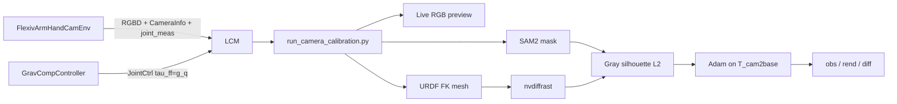

# Differentiable base–camera calibration (sim)

Recover the **robot-base → camera** extrinsics by aligning a SAM2-segmented gray silhouette of the Flexiv arm + hand with an nvdiffrast rendering of the same robot, optimized with Adam.

You **pose the arm freely under gravity compensation** while watching a live RGB window, capture when the robot is visible, segment with SAM2, then optimize.



---

## 1. Prerequisites

Use the `rophi` conda env with MuJoCo, LCM, torch, CUDA, **nvdiffrast**, and **SAM2** (same stack as [tutorial 13](13_foundation_pose_sim.md)).

### LCM multicast (Linux)

```bash
sudo ifconfig lo multicast
sudo route add -net 224.0.0.0 netmask 240.0.0.0 dev lo
```

### nvdiffrast + SAM2

Follow the install steps in tutorial 13 (`nvdiffrast` with matching CUDA, and `third_party/sam2` from the real-time fork). pytorch3d is used only for `so3_exp_map` / `so3_log_map` (CPU build is enough).

---

## 2. Run (three terminals)

```bash
# Terminal 1 — Flexiv arm + hand + calib_camera RGB-D
python run_env.py --config configs/calibration_tutorial/env/flexiv_arm_hand_cam.yaml

# Terminal 2 — gravity compensation (free float / drag in MuJoCo)
python run_controller.py --config configs/calibration_tutorial/controllers/grav_comp.yaml

# Terminal 3 — live RGB capture → SAM2 → optimize extrinsics
python run_camera_calibration.py --config configs/calibration_tutorial/calib_diff_render.yaml
```

Keep `platform.gravity_comp: false` in the env YAML so gravity is not cancelled twice ([03](03_grav_comp.md)).

### Interaction

| Step | What to do |
|------|------------|
| Pose | In the MuJoCo viewer, drag the arm (grav-comp holds it against gravity). Watch **Calib RGB** until the robot is clearly in view |
| Capture | Press **SPACE** in the RGB window (`num_captures`, default 5). ESC finishes early (need ≥2). **Ctrl+C in the terminal** also exits |
| Segment | For each capture, **left-click** the arm/hand, then **ENTER** (R resets clicks) |
| Optimize | Watch the mosaic `obs \| rend \| \|diff\|` — initially slightly mismatched, then aligning |
| Done | Press any key in the mosaic window; terminal prints OpenCV `T_cam2base` (cam_in_base), `T_world2cam`, and error vs MuJoCo GT |

---

## 3. LCM channels

| Channel | Direction | Content |
|---------|-----------|---------|
| `calib_camera` | env → calib | RGB-D |
| `calib_camera_info` | env → calib | `K` + GT OpenCV `T_world2cam` |
| `sw_flexiv_arm_joint_meas` | env → ctrl / calib | 7-DoF arm `q` |
| `sw_robotis_5F_hand_joint_meas` | env → ctrl / calib | 20-DoF hand `q` |
| `sw_flexiv_arm_hand_joint_ctrl` | **grav-comp → env** | $\tau_{\mathrm{ff}}\approx g(q)$, $K_p=K_d=0$ |

The calibration script does **not** publish joint commands (so it does not fight gravity compensation).

---

## 4. What you should observe

1. With grav-comp running, the arm feels weightless in MuJoCo; you can drag it to diverse configurations.
2. The **Calib RGB** window shows the live camera feed so you can confirm visibility before capturing.
3. After each SAM click, a masked gray preview of the robot appears.
4. Optimization starts from **GT cam_in_base ⊕ small SE(3) noise** (~5° / 3 cm on the camera pose in base) — approximately correct, then refined.
5. Over ~200 Adam steps the `|diff|` panel darkens and printed loss decreases; final translation/rotation error vs GT is reported.

---

## 5. Method (short)

- **Observed:** `I_obs = grayscale(RGB) ⊙ SAM2_mask` (then treated as a silhouette).
- **Rendered:** URDF visual meshes at measured `q` ([`RobotMeshFK`](../utils/calibration/robot_mesh_fk.py)) → nvdiffrast soft silhouette under candidate OpenCV **`T_cam2base`** ([`DiffSilhouetteRenderer`](../utils/calibration/diff_silhouette.py)). Same convention as EasyHeC / `eyeball_camera_pose.py`: columns = right, down, forward; translation = camera eye in arm base.
- **Loss:** EasyHeC-style $\sum(\text{mask}-\text{rend})^2 / N$ over views, Adam (`lr=3e-3`, up to 2000 iters, early-stop 200).
- **Parameters:** axis-angle `ω` + translation `t` of `T_cam2base` (6-DoF). Intrinsics `K` are fixed from `CameraInfoData`. Rendering uses `T_world2cam = inv(T_cam2base)`.
- **Mesh:** `arm_only: true` by default (Manipulator-Software `Rizon4_arm_only` / easyhec style).

This is complementary to the classical checkerboard hand–eye path in [`utils/calibration/base_to_eye.py`](../utils/calibration/base_to_eye.py).

---

## 6. Common failures

| Symptom | Likely cause |
|---------|----------------|
| Timeout waiting for CameraInfo | Env not running / LCM multicast not set |
| Arm falls / feels heavy | Start Terminal 2 grav-comp; keep env `gravity_comp: false` |
| Arm shoots upward | Env still has plant-side `gravity_comp: true` (double $g(q)$) |
| Empty / tiny SAM mask | Click on the robot body, not the background; confirm with ENTER |
| Robot not in RGB | Drag in MuJoCo while watching the Calib RGB window before SPACE |
| Init render flipped / far from robot | Fixed by Y-flip after nvdiffrast (FoundationPose convention); pull latest `diff_silhouette.py` |
| Dirty / holey silhouette | Keep `max_faces: 0` (full arm+hand mesh); random face drops punch holes |
| `mycpp` / FoundationPose errors | Not required for this tutorial — use the first-party nvdiffrast path only |
| nvdiffrast CUDA mismatch | Align `nvcc` and `torch.version.cuda` as in tutorial 13 |

---

## 7. Code map

| Path | Role |
|------|------|
| [`assets/scene/flexiv_arm/hand_cam_calib.xml`](../assets/scene/flexiv_arm/hand_cam_calib.xml) | Flexiv + hand scene with `calib_camera` |
| [`env/calibration_tutorial/FlexivArmHandCamEnv.py`](../env/calibration_tutorial/FlexivArmHandCamEnv.py) | Env: joints + RGB-D publish |
| [`communication/.../FlexivArmHandCamPubManager.py`](../communication/lcm/publisher/pub_manager/env/flexiv_arm_5F_hand/FlexivArmHandCamPubManager.py) | LCM pub: arm/hand meas + camera |
| [`configs/calibration_tutorial/env/flexiv_arm_hand_cam.yaml`](../configs/calibration_tutorial/env/flexiv_arm_hand_cam.yaml) | Env config (`gravity_comp: false`) |
| [`configs/calibration_tutorial/controllers/grav_comp.yaml`](../configs/calibration_tutorial/controllers/grav_comp.yaml) | Free-pose gravity compensation |
| [`configs/calibration_tutorial/calib_diff_render.yaml`](../configs/calibration_tutorial/calib_diff_render.yaml) | `num_captures` / opt / SAM2 |
| [`utils/calibration/robot_mesh_fk.py`](../utils/calibration/robot_mesh_fk.py) | URDF visuals → gray mesh at `q` |
| [`utils/calibration/diff_silhouette.py`](../utils/calibration/diff_silhouette.py) | Differentiable gray silhouette |
| [`utils/calibration/diff_base_to_cam.py`](../utils/calibration/diff_base_to_cam.py) | Live RGB capture, SAM2, Adam, viz |
| [`run_camera_calibration.py`](../run_camera_calibration.py) | Entry point |
